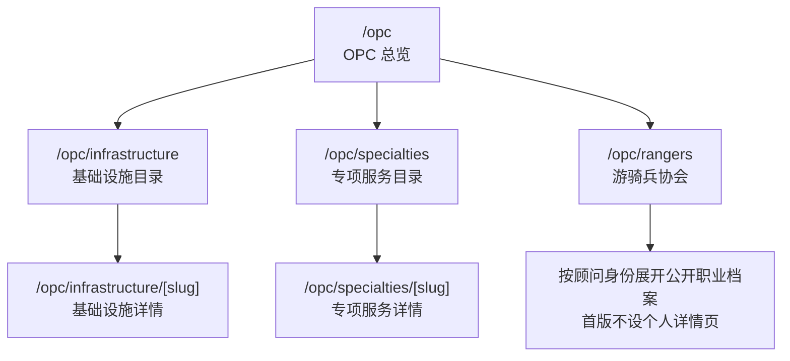

# Vault2077 OPC 页面设计方案

> [!important] 审阅边界
> 本文只设计网站中的 OPC 板块，不定义网站之外的获客、销售、支付、履约、顾问合作或争议处理机制。本文是供审阅的页面方案；确认后再修订 [[Vault2077-OPC-Design-Spec]] 并进入实现。

## 1. 页面要解决的核心问题

OPC 页面不是把服务堆成一个商城，而是帮助超级个体快速作出一个判断：

1. 我需要搭起一整套可以运行的能力——进入**基础设施**。
2. 我只需要解决一个边界清楚的问题——进入**专项服务**。
3. 我的情况高度个性化，需要人与人直接判断——进入**游骑兵协会**。

页面的首要任务因此不是“展示尽可能多的服务”，而是：

- 让用户在首屏后的一个屏幕内理解三个入口的差异。
- 让标准服务的范围、价格、周期、成果和责任主体可核验。
- 让基础设施与专项服务保持联系，但不被误认为套餐与零件的关系。
- 让游骑兵协会与 Vault2077 的直接服务形成清晰、不可误读的责任边界。
- 让用户在无需账户、购物车或在线支付的情况下完成浏览与联系。

## 2. 总体设计命题

### 2.1 对外主张

页面沿用现有标题：

> **一人公司，全栈运行**

建议使用的说明文字：

> 把必须处理、却不该持续消耗创造者精力的事项，整理成边界明确的标准服务；超出标准范围的个案，直接联系独立专家。

### 2.2 视觉概念：OPC 服务总账

OPC 延续 Vault2077 的“文字账本 / 未来档案库”语言，不使用卡片商城、服务图标、人物照片、渐变或赛博朋克装饰。

页面把每项服务表现为一条具有真实编号、修订、状态、价格和周期的登记记录。三个入口不是三张营销卡片，而是同一份总账中的三条不同路径。

### 2.3 OPC 的专属识别：责任断面

本方案建议增加一个只属于 OPC 的页面构件——**责任断面**：

```text
VAULT2077 DIRECT DELIVERY                 EXTERNAL / DIRECT CONTACT
基础设施 + 专项服务          │          游骑兵协会
Vault2077 直接交付            │          用户与独立顾问自行联系
```

断面左侧使用 `--instrument` 深色底，右侧回到纸张底色，中间只用一条硬边界，不使用渐变。

它不是装饰，而是在视觉上回答“谁负责交付”：

- 深色区域：Vault2077 直接提供的标准服务。
- 纸张区域：外部独立顾问的公开职业档案。
- 游骑兵联系方式不进入 OPC 统一联系渠道。

## 3. 信息架构与路由

建议将 OPC 从当前的“一个菜单页 + 一个通用详情页”扩展为以下结构：



| 页面 | 页面职责 | 首版内容量 |
| --- | --- | ---: |
| `/opc` | 解释三条路径，展示有限预览和责任边界 | 不完整平铺目录 |
| `/opc/infrastructure` | 展示全部已发布基础设施 | 最多 10 项 |
| `/opc/infrastructure/[slug]` | 解释一项完整运行能力 | 一项一页 |
| `/opc/specialties` | 按五个专业领域展示专项服务 | 最多 25 项 |
| `/opc/specialties/[slug]` | 解释一个单项专业结果 | 一项一页 |
| `/opc/rangers` | 按十类顾问身份展示公开职业档案 | 单页目录 |

路由原则：

- 对外 URL 使用稳定、可读的英文 slug，页面内始终显示真实服务编号。
- 已公开的旧 `/opc/[slug]` 地址如存在外部访问，应永久重定向到新地址，不静默失效。
- 游骑兵首版不设个人页面，档案使用稳定锚点，例如 `/opc/rangers#ranger-legal-001`。
- 没有通过发布门槛的服务不进入公开目录；页面不得使用虚构价格、周期或“已上线”数量。

## 4. OPC 总览页

### 4.1 页面顺序

1. 全站导航。
2. OPC 页面引言。
3. 三路径判断区。
4. Vault2077 直接服务区。
5. 责任断面。
6. 游骑兵协会预览。
7. 标准服务使用流程。
8. 关键问答。
9. 全站页脚。

### 4.2 桌面线框

```text
┌──────────────────────────────────────────────────────────────────────┐
│ VAULT2077   信息流   OPC 服务台   SiC 学院   边境计划               │
├──────────────────────────────────────────────────────────────────────┤
│ OPC / SERVICE DESK                                                  │
│                                                                      │
│ 一人公司，                              把必须处理、却不该持续消耗   │
│ 全栈运行。                              创造者精力的事项……           │
│                                          STANDARD / DIRECT / EXTERNAL│
├──────────────────────────────────────────────────────────────────────┤
│ CHOOSE A PATH / 先判断问题的形状                                    │
├────┬──────────────┬───────────────────────────────┬──────────────────┤
│ 01 │ 基础设施     │ 搭起一整套可以运行的能力      │ 查看目录      ↗ │
├────┼──────────────┼───────────────────────────────┼──────────────────┤
│ 02 │ 专项服务     │ 解决一个边界清楚的专业问题    │ 查看目录      ↗ │
├────┼──────────────┼───────────────────────────────┼──────────────────┤
│ 03 │ 游骑兵协会   │ 直接联系处理非标准问题的专家  │ 查看名录      ↗ │
├──────────────────────────────────────────────────────────────────────┤
│ VAULT2077 DIRECT DELIVERY / STANDARD SERVICES                 深色区 │
│                                                                      │
│ 基础设施                                        查看全部             │
│ OPC/INFRA/001  公司设立          价格      周期      REV / STATUS    │
│ OPC/INFRA/002  财税运行          价格      周期      REV / STATUS    │
│ ……                                                                   │
│                                                                      │
│ 专项服务                                        查看全部             │
│ 法律  / 财税与财务 / 人力资源 / 知识产权 / 数据与数字合规           │
├───────────────────────────────────────┬──────────────────────────────┤
│ VAULT2077 DIRECT SERVICE ENDS HERE    │ EXTERNAL CONTACT BEGINS HERE │
├───────────────────────────────────────┴──────────────────────────────┤
│ RANGER ASSOCIATION / 游骑兵协会                              纸张区 │
│ 外部独立专家；Vault2077 不参与咨询、定价、付款、交付或争议处理。     │
│ 法律顾问 / 财税顾问 / 创业顾问 / 设计师 / AI 开发专家 / ……          │
│                                                     查看完整名录  ↗ │
├──────────────────────────────────────────────────────────────────────┤
│ HOW STANDARD SERVICES WORK / 确认范围 → 联系 → 交付 → 留档          │
├──────────────────────────────────────────────────────────────────────┤
│ FAQ                                                                  │
└──────────────────────────────────────────────────────────────────────┘
```

### 4.3 页面引言

沿用全站 `PageIntro` 的左右分栏结构，不为 OPC 另造营销型 Hero。

建议字段：

- Eyebrow：`OPC / SERVICE DESK`
- 标题：`一人公司，全栈运行`
- 说明：本方案第 2.1 节文案
- 状态行：只展示真实状态，例如 `STANDARD SERVICES / DIRECT DELIVERY / EXTERNAL DIRECTORY`

不在 Hero 中放“立即购买”“马上咨询”或二维码。用户应先理解服务边界，再进入具体服务。

### 4.4 三路径判断区

这是总览页最重要的导航构件。

三条记录均为整行链接，每条只回答一个问题：

| 编号 | 入口 | 判断句 | 结果句 |
| --- | --- | --- | --- |
| `01` | 基础设施 | 多个事项必须互相配合，才能开始或稳定运行 | 搭起一整套能力 |
| `02` | 专项服务 | 问题边界明确，只需要一个主要专业结果 | 解决一个问题 |
| `03` | 游骑兵协会 | 结果依赖个案判断、谈判、争议处理或深度定制 | 直接联系独立专家 |

整行在 hover、focus 时反相；不使用三张卡片、彩色标签或图标。

### 4.5 直接服务区

基础设施与专项服务共同放在深色 `--instrument` 区域，并明确标注：

> `VAULT2077 DIRECT DELIVERY / STANDARD SERVICES`

首页只展示：

- 已正式发布的基础设施前 3—5 项。
- 专项服务的五个专业领域入口，以及每个领域的真实已发布数量。
- “查看全部基础设施”和“查看全部专项服务”两个文字入口。

首页不平铺 35 个项目，也不显示内部 P0/P1/P2 开发优先级。

### 4.6 游骑兵协会预览

责任断面之后恢复纸张底色，先放固定关系说明，再展示十类顾问身份入口。

首页不展示：

- 顾问照片。
- 当前机构、所在地或服务地区。
- 价格、服务方式或平台评分。
- “推荐专家”“热门顾问”或排序名次。
- OPC 统一工作人员联系方式。

如已有公开档案，可以只预览最近完成确认的 2—3 条记录；“最近确认”不是质量排名。

### 4.7 标准服务流程

流程只描述网站能够承诺的事实：

1. 阅读适用对象、包含与不包含内容。
2. 准备材料并通过统一渠道联系 OPC 工作人员。
3. 工作人员确认是否符合标准范围。
4. 按详情页确认的方式进入线下付款和交付。
5. 用户收到详情页列明的成果。

游骑兵协会不进入这条流程。

## 5. 基础设施目录页

### 5.1 页面目标

让用户比较“哪一套运行能力适合我”，而不是比较折扣套餐。

### 5.2 页面结构

1. 页面引言：解释基础设施是完整能力，不是专项服务打包折扣。
2. 状态行：已发布数量、最后核验日期。
3. 十项基础设施登记列表。
4. “基础设施与专项服务如何区分”说明。
5. 标准服务统一联系说明。

### 5.3 列表字段

桌面端每条记录显示：

| 字段 | 说明 |
| --- | --- |
| 编号 | `OPC/INFRA/001` |
| 名称与结果 | 名称 + 一句话说明达到什么可运行状态 |
| 整体价格 | 含税规则和官方费用另计状态必须明确 |
| 周期 | 同时说明起算条件 |
| 修订与状态 | `REV.01 / EFFECTIVE` |

移动端保留名称、结果、价格、周期、编号与修订；不为压缩布局而隐藏关键交易信息。

### 5.4 列表排序

- 公开页按用户经营生命周期排序，不按内部开发优先级排序。
- 建议顺序：设立与启动 → 日常运行 → 交易与资产 → 扩张与跨境 → 暂停与退出。
- 服务状态变化时保留稳定编号，不复用编号。

## 6. 专项服务目录页

### 6.1 页面目标

让用户先按专业领域定位，再比较同一领域内的五个明确问题。

### 6.2 页面结构

1. 页面引言：专项服务只解决一个边界明确的问题并交付一个主要结果。
2. 五领域文字索引。
3. 五个连续分组，每组最多五条服务记录。
4. “何时应进入基础设施 / 何时应联系游骑兵”边界说明。
5. 标准服务统一联系说明。

五领域固定为：

- 法律。
- 财税与财务。
- 人力资源。
- 知识产权。
- 数据与数字合规。

首版不设置搜索框。25 项内容通过五个自然分组和页内锚点已经可以快速定位；搜索会增加界面和无结果状态，却不会显著改善判断。

### 6.3 分组交互

- 顶部索引是普通文字锚点，不做胶囊标签。
- 到达分组后，URL 保留 hash，便于复制和返回。
- 每个领域标题旁只显示真实已发布数。
- 服务行字段与基础设施一致，但结果描述强调“一个主要成果”。

## 7. 标准服务详情页

基础设施和专项服务共用一个详情骨架，但在核心内容上有所区别。

### 7.1 共用信息顺序

1. 面包屑、服务编号、修订、状态、生效日期。
2. 服务名称、一句话结果、整体价格与周期。
3. 适合谁 / 不适合谁。
4. 你将获得什么。
5. 包含内容 / 不包含内容。
6. 用户需要提供的材料与作出的决定。
7. 交付阶段、周期与起算条件。
8. 官方费用、税费、第三方费用和修改次数。
9. 专业复核角色。
10. 关联入口与超出范围后的去向。
11. 统一联系区。
12. 责任、隐私和版本说明。

### 7.2 两类详情页的差异

| 基础设施详情 | 专项服务详情 |
| --- | --- |
| 突出多个模块如何形成闭环 | 突出一个问题和一个主要成果 |
| 必须展示实施阶段和模块依赖 | 必须展示问题边界和判断前提 |
| 可以关联拆出的专项服务 | 可以说明何时升级为基础设施 |
| 重点是“达到可运行状态” | 重点是“完成一个专业结果” |

### 7.3 桌面布局

采用全站约定的 `8 + 4` 栅格：

```text
┌──────────────────────────────────────────────┬───────────────────────┐
│ SERVICE RECORD / 主内容 8 栏                 │ SERVICE FACTS / 4 栏  │
│                                              │                       │
│ 适合 / 不适合                                │ 价格                  │
│ 成果                                         │ 周期                  │
│ 包含 / 不包含                                │ 修订 / 生效日期       │
│ 材料 / 决策                                  │ 专业复核              │
│ 阶段 / 起算条件                              │                       │
│ 边界 / 关联入口                              │ 查看联系方式          │
└──────────────────────────────────────────────┴───────────────────────┘
```

右栏可以在桌面端保持可见，但不得遮挡页脚或责任说明。

移动端按阅读顺序堆叠，并在底部提供一个固定的文字按钮“查看联系方式”；按钮只跳转到本页联系区，不直接触发付款。

## 8. 游骑兵协会页

### 8.1 页面定位

这是外部独立顾问名录，不是专项服务目录、专家商城或平台撮合页。

页首固定显示：

> 游骑兵为外部独立专家。正式档案展示经本人确认的公开职业档案和联系方式；预览档案会明确标注预览状态。Vault2077 不参与后续咨询、定价、付款、交付或争议处理。

### 8.2 页面结构

1. 页面引言与固定关系说明。
2. 十类顾问身份文字索引。
3. 按身份排列的十个连续分组。
4. 每组中的简化公开职业档案。
5. 信息确认与退出说明。

### 8.3 档案行

默认收起状态显示：

- 公开姓名。
- 一个主要顾问身份。
- 不超过 50 字的职业简介。
- 不超过 5 个专业标签。
- 最近确认日期与公开状态。

展开后只增加：

- 可选的职业资格或代表性经历。
- 顾问本人提供的公开联系方式。
- 固定的独立关系说明。

不展示当前机构、所在地、服务地区、详细履历、客户名单、价格和服务方式。

### 8.4 交互

- 使用原生可访问的展开记录，不使用弹窗卡片。
- 每条档案拥有稳定锚点。
- “展开联系方式”是记录内的明确动作。
- 联系方式失效时显示 `CONTACT UNAVAILABLE / 等待本人重新确认`，不转给其他顾问。
- 首版不提供搜索、评分、推荐、热门排序或自动匹配。

## 9. 视觉系统

### 9.1 沿用的令牌

| 用途 | 令牌 |
| --- | --- |
| 页面底色 | `--paper: #F3F3EF` |
| 明亮纸色 | `--paper-bright: #FBFBF8` |
| 主文字 | `--carbon: #11120F` |
| 次级文字 | `--graphite: #3F413D` |
| 元数据 | `--ash: #74766F` |
| 分隔线 | `--rule: #C9CAC4` |
| 直接服务区 | `--instrument: #181C1E` |

不为三个入口增加三种强调色。类型与责任通过编号、位置、底色反转和文字状态表达。

### 9.2 字体

- 中文标题：`Noto Serif SC`，600。
- 中文正文与界面：`Noto Sans SC`，400 / 500 / 700。
- 英文、编号、价格、日期与修订：`Manrope Variable`，使用等宽数字。

### 9.3 组件形态

- 使用连续登记行，不使用圆角卡片。
- 使用 1px 规则线，不使用阴影。
- 按钮保持矩形，圆角不超过 2px。
- 整行 hover / focus 反相，链接仍保留明确焦点框。
- 不使用插画、装饰图标或服务场景照片。游骑兵协会专家头像作为身份识别材料统一放行，不视为装饰图像；正式档案使用经确认头像，明确标注为预览的档案可使用预览头像。其他 OPC 页面不得借此增加配图。
- 不使用轮播、视差、粒子、3D 或持续闪烁状态。

### 9.4 动效

- 页面首次进入只允许一次 300—500ms 的内容显现。
- 行反相与文字位移控制在 180ms 左右。
- 尊重 `prefers-reduced-motion`，关闭非必要动画。

## 10. 响应式方案

| 宽度 | 布局 |
| --- | --- |
| `1280px+` | 12 栏；详情页 8+4；登记行完整显示全部字段 |
| `768–1279px` | 8 栏；减少说明列宽；详情侧栏回到普通文档流 |
| `<768px` | 4 栏；登记行分两层；三路径区保持连续行而非横向卡片 |

### 10.1 移动端总览

```text
┌───────────────────────────┐
│ OPC / SERVICE DESK        │
│ 一人公司，                │
│ 全栈运行。                │
│ 说明文字                  │
├───────────────────────────┤
│ 01  基础设施          ↗   │
│     搭起一整套能力        │
├───────────────────────────┤
│ 02  专项服务          ↗   │
│     解决一个明确问题      │
├───────────────────────────┤
│ 03  游骑兵协会        ↗   │
│     直接联系独立专家      │
├───────────────────────────┤
│ VAULT DIRECT / 深色       │
│ 已发布服务预览            │
├───────────────────────────┤
│ DIRECT ENDS HERE          │
├───────────────────────────┤
│ RANGERS / 纸张            │
│ 固定关系说明 + 身份入口   │
└───────────────────────────┘
```

移动端不能隐藏价格、周期、修订与责任主体；可以折叠长说明，但不能折叠交易边界。

## 11. 状态与异常

| 情形 | 页面表现 |
| --- | --- |
| 服务尚未通过发布门槛 | 不进入公开目录 |
| 某入口暂时没有已发布内容 | 明确显示“正在完成专业确认”，不放占位服务 |
| 服务已退役 | 保留稳定 URL，显示退役状态、生效区间和替代入口 |
| 统一联系方式暂不可用 | 保留服务信息，禁用联系动作并说明原因 |
| 游骑兵联系方式失效 | 隐藏失效联系方式，保留档案状态与重新确认说明 |
| 顾问退出协会 | 稳定锚点显示“已不再列入游骑兵协会”，不自动替换 |

## 12. 可访问性与内容质量

- 语义化标题层级，三类入口和专业领域均可由屏幕阅读器识别。
- 所有整行链接、展开按钮和联系方式可通过键盘操作。
- 状态不能只靠颜色表达。
- 正文与背景至少满足 WCAG AA；关键正文优先达到 AAA。
- QR 码必须同时提供可复制的文字联系方式。
- 价格、周期、官方费用、税费和起算条件不得只藏在 FAQ 或联系后说明。
- 页面中的服务数量、更新日期、修订和状态均由真实数据生成。

## 13. 与现有页面的关系

现有 OPC 页面已经具备以下可保留基础：

- 全站 `PageIntro`。
- `ChannelRibbon`。
- 登记行式 `ServiceList`。
- 深色 OPC 区域与整行反相交互。
- 统一联系区和服务详情的 8+4 基础结构。

需要重构的部分：

- 当前单一服务菜单需要拆成总览、基础设施、专项服务和游骑兵协会。
- 当前“全部由 Vault2077 内部专业人员直接交付”的概括不适用于游骑兵协会。
- 当前服务分类模型无法表达“十项基础设施 + 五领域专项服务 + 十类顾问身份”。
- 当前 `/opc/[slug]` 需要演进为两类标准服务详情路由。
- 当前 OPC 设计规范中的旧专业分类，需要以 [[Vault2077-OPC-Development-Plan]] 的已确认分类为准完成修订。

## 14. 建议实施顺序

本文获批后建议分四步实现：

1. **结构层**：建立三类内容模型、真实状态字段、路由和旧地址重定向。
2. **目录层**：完成 OPC 总览、基础设施目录、专项服务目录和责任断面。
3. **详情层**：完成两类标准服务详情模板与统一联系状态。
4. **协会层**：完成游骑兵单页目录、档案展开、独立联系方式和失效状态。

每一步都在 `360 / 768 / 1280 / 1440px` 下检查键盘操作、内容完整性和责任边界。

## 15. 本轮需要确认的设计决策

1. 是否同意 OPC 首页只做路径判断和有限预览，不平铺全部 35 项标准服务。
2. 是否同意将基础设施、专项服务、游骑兵协会拆为三个独立目录入口。
3. 是否同意使用“深色直接服务区 + 纸张顾问区 + 责任断面”作为 OPC 的专属视觉识别。
4. 已确认游骑兵专家头像作为身份识别例外并统一放行；正式档案和预览档案分别标记状态，首版仍不使用搜索、评分或推荐。
5. 是否同意统一联系方式只服务于基础设施与专项服务，不出现在游骑兵流程中。

## 16. 关联文档

- [[Vault2077-OPC-Development-Plan|OPC 开发计划]]
- [[Vault2077-OPC-Design-Spec|OPC 现行设计规范]]
- [[Vault2077-Design-Spec|全站设计规范]]
- [[CONTEXT|项目统一术语]]
