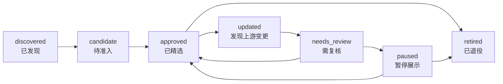
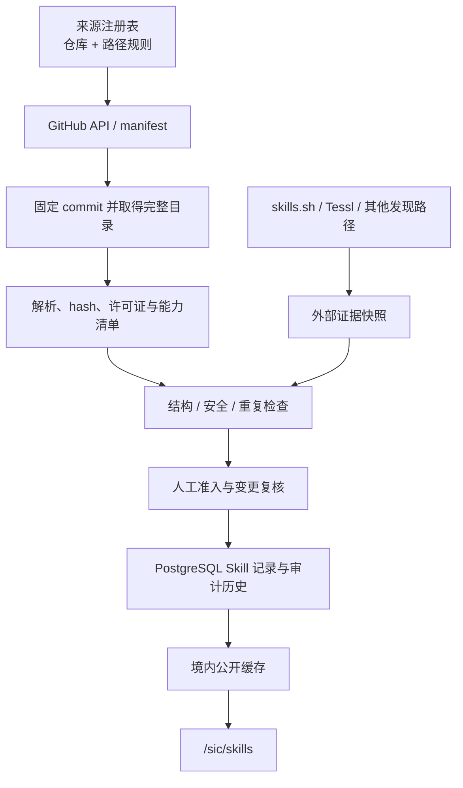

# Vault2077 SiC Skill 精选集策划方案

> **已废止。** 现行决定是不建设 Skill 榜单、`/sic/skills` 独立频道或 Skill 精选预览；SiC 只保留已经确认且有稳定来源的现有栏目。本文件仅作为历史调研记录，下面的路径、数量、页面和实施阶段均不得进入产品实现或上线范围。现行边界以 `Vault2077-SiC-Design-Spec.md` 为准。

## 1. 决策摘要

SiC 不应建设一个“什么都有的 Skill 市场”，而应建设一个**可追溯、可解释、可持续更新的 Skill 精选集**。

核心决定如下：

1. **产品名用“Skill 精选”，不叫“Skill 市场”。** Vault2077 首期不托管交易、不代替原作者分发，也不在网页内执行安装。
2. **首发 48 个 Skill，机构原生与社区验证各占 24 个。** “官方”只说明作者身份，不自动代表质量；社区热度也只负责发现，不自动取得准入资格。
3. **自动更新的是事实，不是编辑判断。** 系统每日发现上游变更、许可证变化、安全风险和外部热度；人决定首次收录、重大更新、风险边界、去重和下架。
4. **原始仓库是内容事实源。** GitHub 官方 API、仓库 manifest、固定 commit 与内容 hash 构成主数据；skills.sh、Tessl 和其他聚合器只提供外部证据。
5. **在 SiC 内设独立路径 `/sic/skills`。** `/sic` 首页只放精选预览，不把 48 个 Skill 塞进现有右侧榜单。
6. **不建立综合分和伪客观排名。** 页面分别展示“来源身份、人工复核、维护活跃、外部采用、安全检查、场景评测”等证据。

一句话定位：

> SiC Skill 精选把分散在官方团队和高质量社区中的 Agent 工作方法，整理成一套适合超级个体查找、判断和安全采用的能力索引。

## 2. 产品角色与边界

### 2.1 为谁服务

主要用户是中国大陆的技术型超级个体与一至三人的小团队。他们通常已经在使用 Codex、Claude Code、Cursor、GitHub Copilot、Gemini CLI 等 Agent，但面临三个问题：

- 不知道某项任务是否已有成熟 Skill；
- 无法区分“热门”“原作者发布”“结构完整”和“真的有效”；
- 不愿为几十个仓库持续追踪更新、安全和许可证。

### 2.2 用户完成的主要任务

用户进入精选集后，应能在三分钟内回答：

1. 我现在的任务属于哪一类？
2. 哪几个 Skill 值得比较？
3. 它来自谁，为什么被收录？
4. 需要哪些工具、网络、权限或凭据？
5. 最近由谁复核，是否发生过重要变化？
6. 去哪里查看原文并自行安装？

### 2.3 明确不做

- 不复制全网 Skill，也不追求“数量最多”；
- 不把仓库 Star、npm 下载量和 Skill 安装量混成一个分数；
- 不把社区热度表述为质量、安全或官方认证；
- 不在浏览器里执行脚本、连接用户 Agent 或索取第三方密钥；
- 首期不提供收藏、个人推荐、安装历史等需要账户的能力；
- 不把 Skill 条目混入论文、档案、课程、播客四个既有内容组；
- 不把 Skill 精选伪装成平台原生榜。

## 3. 精选集结构

精选集使用三条编辑泳道，而不是单一“官方 / 非官方”二分法。

| 泳道 | 含义 | 首发占比 | 页面表达 |
| --- | --- | ---: | --- |
| 机构原生 | Skill 由所涉及产品、平台或专业机构直接维护 | 50% | `原作者` |
| 社区验证 | 独立作者或社区维护，已通过 SiC 完整准入 | 50% | `社区验证` |
| 趋势观察 | 近期出现明确采用或讨论信号，但尚未完成准入 | 不进入 48 个正式条目 | 独立“观察中”，不得写“推荐” |

“原作者”是来源事实，“社区验证”是 SiC 的编辑结论。两者都必须通过同一套安全、许可证、维护和任务验证门槛。

## 4. 来源策略

### 4.1 主数据源

每个 Skill 的 source of record 固定为原始公开仓库中的具体路径：

```text
stable_id = github_owner + repository + skill_path
version   = commit_sha
content   = SKILL.md + scripts + references + assets
identity  = repository manifest / plugin manifest / author ownership
license   = nearest applicable license file
```

采集优先级：

1. 读取上游官方 manifest，例如 `skills.sh.json`、plugin marketplace manifest；
2. manifest 不完整时，用 GitHub Git Trees API 枚举 `SKILL.md`；
3. 固定 commit SHA 后读取完整 Skill 目录；
4. 计算目录内容 hash，保留许可证、依赖、脚本和外部域名快照；
5. 页面始终链接原始仓库与原始 Skill 路径。

GitHub 已提供跨公开仓库搜索 `SKILL.md` 的 `gh skill search`，可输出仓库、路径、描述和仓库 Star；它适合发现和核验，但 Star 是仓库级信号，不是单个 Skill 的使用量。[GitHub CLI `gh skill search`](https://cli.github.com/manual/gh_skill_search)

### 4.2 首发直接来源

| 来源 | 身份 | 首发数 | 采用理由 | 注意事项 |
| --- | --- | ---: | --- | --- |
| [NVIDIA Skills](https://github.com/NVIDIA/skills) | 机构原生 | 3 | 有 Skill Card、benchmark、签名和系统化治理，适合作为高证据样板 | 专业领域较深，首发只取通用 AI / 数据项 |
| [Hugging Face Skills](https://github.com/huggingface/skills) | 机构原生 | 6 | AI 模型、数据集、评测与应用链完整，跨主流 Agent | 部分能力需要账户、Token 或较大本地算力 |
| [Cloudflare Skills](https://github.com/cloudflare/skills) | 机构原生 | 5 | 数量小、边界清楚、适合小团队上线服务 | 部署、远程写入和代码执行需明确副作用 |
| [Vercel Agent Skills](https://github.com/vercel-labs/agent-skills) | 机构原生 | 5 | 前端、性能、写作与设计规则成熟 | `vercel-optimize` 需要平台数据，不能当通用性能 Skill |
| [Trail of Bits Skills](https://github.com/trailofbits/skills) | 专业机构原生 | 5 | 安全审计、供应链和测试方法专业性高 | CC BY-SA 4.0；优先链接上游，不默认镜像 |
| [obra/superpowers](https://github.com/obra/superpowers) | 社区验证 | 7 | 社区采用广，工程流程完整，强调证据和验证 | 方法较强势，详情页应说明适用条件 |
| [Addy Osmani Agent Skills](https://github.com/addyosmani/agent-skills) | 社区验证 | 7 | 覆盖定义、实现、可观测性等生产开发阶段 | 与其他工程流程包需要逐项去重 |
| [Matt Pocock Skills](https://github.com/mattpocock/skills) | 社区验证 | 5 | 模块设计、领域语言、研究和原型方法差异化明显 | 用户调用型与自动触发型需分别标注 |
| [planning-with-files](https://github.com/OthmanAdi/planning-with-files) | 社区验证 | 1 | 为长任务提供文件化计划、恢复和完成门禁 | 会在仓库写入计划文件，需提前说明 |
| [Scientific Agent Skills](https://github.com/K-Dense-AI/scientific-agent-skills) | 社区验证 | 4 | 研究方法与科学写作覆盖广，维护和测试机制较清楚 | 不把研究辅助描述为医学或专业决策能力 |

### 4.3 观察与第二批来源

- [OpenAI Plugins](https://github.com/openai/plugins)：当前 OpenAI 公共插件目录；应按插件逐项核验 Skill 与许可证。
- [Anthropic Skills](https://github.com/anthropics/skills)：质量较高但许可证混合；文档四件套是 source-available，不应整库统一标为 Apache-2.0。
- [MicrosoftDocs Agent Skills](https://github.com/MicrosoftDocs/Agent-Skills)：Azure 覆盖很广，第二批按超级个体使用场景少量选择。
- [Google Skills](https://github.com/google/skills) 与 Google Workspace CLI：适合作为办公自动化扩展，需核实命令副作用和授权范围。
- [GitHub Awesome Copilot](https://github.com/github/awesome-copilot)：属于官方组织承载的社区贡献，不应自动标成 GitHub 官方 Skill。
- [NVIDIA Skills](https://github.com/NVIDIA/skills) 的机器人、CUDA、仿真等专业项：待 SiC 出现相应专题后再扩容。

重要修正：`openai/skills` 已被官方标记为 deprecated，不能继续作为稳定主源；现有条目只能作为历史兼容证据，持续更新应迁移到 `openai/plugins`。

## 5. 首发 48 个 Skill

以下是**首发准入候选**，不是未经复核即可上线的硬编码列表。每项仍需在采集时固定 commit、核对许可证并执行任务验证。

### 5.1 业务定义与任务组织

| Skill | 来源 | 介绍 |
| --- | --- | --- |
| `interview-me` | Addy Osmani | 通过逐问收敛含糊需求，适合用户知道目标但尚未形成清楚任务边界时。 |
| `idea-refine` | Addy Osmani | 对粗略想法做发散与收敛，输出可比较的方案而不是直接进入实现。 |
| `spec-driven-development` | Addy Osmani | 把新功能或变更转成带验收条件的规格，减少“边写边猜”。 |
| `context-engineering` | Addy Osmani | 为长任务组织必要上下文、渐进加载和信息边界，避免一次性塞入无关材料。 |
| `domain-modeling` | Matt Pocock | 建立项目统一术语和领域关系，适合长期维护、多人或多 Agent 协作。 |
| `planning-with-files` | OthmanAdi | 用持久 Markdown 文件保存计划、发现和进度，降低长任务因压缩或重启丢失上下文的风险。 |

### 5.2 研究与知识生产

| Skill | 来源 | 介绍 |
| --- | --- | --- |
| `aiq-research` | NVIDIA | 面向可追溯研究任务组织检索、证据和综合输出，适合技术调研与决策准备。 |
| `huggingface-papers` | Hugging Face | 在 Hugging Face 论文生态中检索、理解并关联模型与实现。 |
| `research` | Matt Pocock | 只使用高可信一手来源完成问题调查，并在仓库中形成带引用的研究文档。 |
| `literature-review` | K-Dense | 组织系统化文献检索、筛选与综合，强调证据边界。 |
| `scientific-writing` | K-Dense | 生成证据可追溯的科学写作草稿，分离事实、解释和待核验结论。 |
| `peer-review` | K-Dense | 对获授权稿件进行本地、保密的结构化同行评阅，不代替正式审稿决定。 |
| `statistical-analysis` | K-Dense | 选择并执行常见统计分析流程，明确假设、适用条件和结果解释边界。 |

### 5.3 AI、模型与数据

| Skill | 来源 | 介绍 |
| --- | --- | --- |
| `hf-cli` | Hugging Face | 通过官方 CLI 管理模型、数据集、仓库和常用 Hub 操作。 |
| `huggingface-datasets` | Hugging Face | 创建、校验、转换和发布 Hugging Face Dataset。 |
| `huggingface-local-models` | Hugging Face | 选择并运行本地模型，说明硬件、量化和运行环境约束。 |
| `huggingface-community-evals` | Hugging Face | 设计并运行社区模型评测，保存可复现配置和结果。 |
| `huggingface-gradio` | Hugging Face | 用 Gradio 构建模型演示和交互界面，适合快速验证 AI 产品。 |
| `accelerated-computing-cudf` | NVIDIA | 判断并实施 pandas 到 cuDF 的 GPU 加速路径，避免无依据地宣称性能提升。 |
| `rag-eval` | NVIDIA | 设计 RAG 检索与回答质量评测，分离检索、忠实度和任务效果。 |

### 5.4 软件开发与架构

| Skill | 来源 | 介绍 |
| --- | --- | --- |
| `source-driven-development` | Addy Osmani | 在依赖框架、库或外部规范时，先读取当前一手资料再实现。 |
| `api-and-interface-design` | Addy Osmani | 设计清楚、可演进的 API 与模块接口，关注兼容性和行为边界。 |
| `codebase-design` | Matt Pocock | 用“深模块”原则收紧接口、隐藏复杂度并找到可测试的设计接缝。 |
| `prototype` | Matt Pocock | 构建可丢弃原型验证状态模型、逻辑或界面方向，不把试验误当成生产实现。 |
| `react-best-practices` | Vercel | 检查 React / Next.js 的数据流、bundle、渲染和性能模式。 |
| `composition-patterns` | Vercel | 用组合、复合组件和状态提升替代布尔属性膨胀。 |
| `agents-sdk` | Cloudflare | 使用 Cloudflare Agents SDK 构建带状态或实时能力的 Agent 应用。 |
| `durable-objects` | Cloudflare | 为协同、会话和强一致状态选择并实现 Durable Objects。 |
| `wrangler` | Cloudflare | 用 Wrangler 开发、配置和发布 Cloudflare 项目，并明确远程写操作。 |

### 5.5 前端、体验与内容

| Skill | 来源 | 介绍 |
| --- | --- | --- |
| `web-design-guidelines` | Vercel | 从可访问性、交互、表单、性能和本地化等维度审查网页界面。 |
| `writing-guidelines` | Vercel | 审查技术文档与产品文字的结构、语气、代码示例和可读性。 |
| `web-perf` | Cloudflare | 诊断 Web 性能瓶颈并提出可验证的优化路径。 |

### 5.6 测试、调试与代码评审

| Skill | 来源 | 介绍 |
| --- | --- | --- |
| `systematic-debugging` | superpowers | 先复现、定位根因再修复，减少猜测式补丁。 |
| `test-driven-development` | superpowers | 按红—绿—重构循环交付小切片，并保持即时反馈。 |
| `verification-before-completion` | superpowers | 在宣称完成前运行最新验证命令，用输出证据支撑结论。 |
| `requesting-code-review` | superpowers | 提交评审前整理范围、验证证据、风险与关注点。 |
| `receiving-code-review` | superpowers | 对评审意见先验证再处理，避免机械接受或情绪化反驳。 |
| `property-based-testing` | Trail of Bits | 用性质和生成数据扩大测试覆盖，寻找示例测试遗漏的边界。 |
| `differential-review` | Trail of Bits | 聚焦变更前后差异进行安全与质量评审，建立影响路径。 |

### 5.7 安全与供应链

| Skill | 来源 | 介绍 |
| --- | --- | --- |
| `insecure-defaults` | Trail of Bits | 发现默认凭据、宽松权限和 fail-open 等不安全默认值。 |
| `supply-chain-risk-auditor` | Trail of Bits | 审查依赖来源、维护状态、发布链路和潜在供应链风险。 |
| `semgrep-rule-creator` | Trail of Bits | 为项目风险模式编写、测试并约束 Semgrep 规则。 |
| `cloudflare` | Cloudflare | 在 Cloudflare 产品间选择正确能力，并识别账户、域名、Token 与远程副作用。 |

### 5.8 交付与持续运行

| Skill | 来源 | 介绍 |
| --- | --- | --- |
| `observability-and-instrumentation` | Addy Osmani | 在实现阶段加入结构化日志、指标、追踪和可操作告警。 |
| `using-git-worktrees` | superpowers | 为并行任务建立隔离工作树，避免分支和未提交改动互相污染。 |
| `finishing-a-development-branch` | superpowers | 在任务完成后验证、选择合并或 PR 路径，并处理工作树收尾。 |
| `resolving-merge-conflicts` | Matt Pocock | 按双方原始意图逐块解决 merge / rebase 冲突并完成操作。 |
| `vercel-optimize` | Vercel | 基于真实 Vercel 指标定位成本、缓存、函数和性能问题。 |

## 6. 为什么这批不是“官方优先”

首发的 48 项严格保持 24:24，而不是为了形式平均，而是让两个证据维度互补：

- 机构原生 Skill 更适合说明产品的正确使用方式和当前接口；
- 社区 Skill 更擅长沉淀跨平台工作法、Agent 失误模式和完整工程流程；
- 专业机构 Skill 提供安全、研究和测试领域的深度；
- 热度只用来发现遗漏，最终仍以任务价值、证据和风险为准。

每个来源首发最多 7 项，任何单一厂商、作者或超大仓库都不能占据首页多数位置。

## 7. 准入标准

### 7.1 七个硬门槛

一项 Skill 只有同时满足以下条件才可进入正式精选：

1. **来源可追溯**：能定位到原作者仓库、具体路径和 commit；
2. **许可证明确**：可说明展示、缓存和再分发边界；
3. **结构合规**：`SKILL.md`、frontmatter、引用文件和依赖可解析；
4. **维护可接受**：仓库未归档，关键问题未长期无人处理，或内容本身稳定且无需频繁更新；
5. **安全通过**：无未解释的高危脚本、密钥读取、隐蔽联网、越权或提示注入；
6. **任务测试通过**：至少一个真实场景能观察到工作流被正确触发和执行；
7. **无实质重复**：与已收录项相比有清楚的任务边界或方法增量。

任一硬门槛失败即不准入，不用“高热度”抵消。

### 7.2 社区热门如何进入候选池

社区热度必须至少命中以下两个独立信号，才进入人工候选队列：

- skills.sh 的单 Skill 安装量、Trending 或 Hot；
- 仓库近期 release、有效提交、issue 响应或贡献者活动；
- 在多个独立目录、文章或团队配置中重复出现；
- 有公开场景评测、benchmark、案例或可复现任务证据。

页面不得把这些信号合成“SiC 质量分”。仓库 Star 必须标注为“来源仓库 Star”，不能写成 Skill Star。

### 7.3 外部证据的角色

- [skills.sh API](https://www.skills.sh/docs/api) 提供稳定 ID、去重安装量、All Time / Trending / Hot、官方精选、内容 hash 和多家安全审计；但 API 依赖 Vercel OIDC，因此作为可选证据 adapter，而非唯一生产依赖。
- [Tessl Review](https://docs.tessl.io/evaluate/evaluating-skills) 可检查规范、实现质量和触发描述；[Tessl 场景评测](https://docs.tessl.io/evaluate/evaluate-skill-quality-using-scenarios) 可比较有无 Skill 时的任务效果。它适合作为评测层，不是无需授权的全量 catalog API。
- Agent Plugins、Agent Skill Exchange、awesome lists 等只做发现路径，不替代原始发布者，也不直接进入公开内容。

## 8. 维护机制

### 8.1 原则

> 建设“自动更新的精选集”，而不是“自动生成的精选集”。

人工负责判断，自动化负责持续发现事实变化。

### 8.2 Skill 准入状态

这些状态专用于精选条目，不替代 SiC 发布源现有的 `approved / retired` 术语：



### 8.3 更新分级

| 变更级别 | 典型变化 | 动作 |
| --- | --- | --- |
| A：低风险 | 文案、链接、示例、reference 更新；无权限或行为变化 | 自动校验通过后可更新事实快照，保留 diff |
| B：工作流变化 | 触发条件、核心步骤、验收门禁、工具选择变化 | 必须人工复核后发布 |
| C：能力变化 | 新增脚本、外部域名、包安装、凭据、部署、远程写入或允许工具 | 自动进入 `needs_review`，必须人工复核 |
| D：阻断变化 | 许可证撤回、仓库归档、内容删除、高危或严重安全结论 | 自动 `paused`，人工决定恢复或退役 |

### 8.4 节奏

- 每日：同步 commit、内容 hash、许可证、归档状态、安全与外部信号；
- 每周：处理新候选、B/C 类更新和社区热门变化；
- 每月：复核长时间未维护、外链失效、重复项和类别失衡；
- 每季度：调整来源配额、分类体系和首发 / 观察名单；
- 每年：对全部正式条目至少完成人工再确认。

每条公开记录显示三个不同时间：

- `上游更新`：原始 Skill 最近变化；
- `SiC 同步`：系统最近成功取得快照；
- `人工复核`：编辑最近确认其适用性与风险。

## 9. 数据与系统设计

### 9.1 统一记录

```ts
type SkillRecord = {
  id: string;                 // owner/repo/path
  slug: string;
  name: string;
  zhTitle: string;
  summary: string;
  category: string;
  sourceLane: "original" | "community";
  sourceRepo: string;
  sourcePath: string;
  sourceUrl: string;
  sourceCommit: string;
  contentHash: string;
  license: {
    spdx?: string;
    url: string;
    redistribution: "allowed" | "link_only" | "review";
  };
  compatibility: string[];
  requirements: string[];
  capabilities: {
    scripts: boolean;
    networkDomains: string[];
    credentials: string[];
    remoteWrite: boolean;
    deploy: boolean;
  };
  risk: "low" | "medium" | "high";
  status: "candidate" | "approved" | "needs_review" | "paused" | "retired";
  externalSignals: Array<{
    provider: string;
    metric: string;
    value: string | number;
    observedAt: string;
    sourceUrl: string;
  }>;
  upstreamUpdatedAt: string;
  syncedAt: string;
  reviewedAt?: string;
  curatorNote: string;
};
```

上游事实与 SiC 编辑字段必须分开。上游名称、许可证、commit 和脚本不能被中文介绍覆盖；中文标题、分类和编辑说明也不能伪装成作者原话。

### 9.2 采集路径



系统实现不新增第五条采集通道。若方案获批，Skill catalog 应作为既有 `rankings` 通道内独立 `packet_kind = skill_catalog` 的确定性任务运行；它不进入 LLM 编辑队列，也不与平台原生榜混成同一产品含义。

公开页面只读本地持久化结果，不能在用户访问时实时请求 GitHub、skills.sh 或 Tessl。单个 adapter 失败时保留最近成功快照，并显示数据过期。

### 9.3 人工决策如何保存

来源注册、首批名单、中文编辑字段和风险例外进入受评审的版本化 registry 配置；变更通过 PR 审核，生产库保存每次发布的不可变审计记录。SiC 公开页不增加通用管理入口，避免突破现有后台边界。

## 10. 嵌入 SiC 的信息架构

### 10.1 路由

| 路径 | 职责 |
| --- | --- |
| `/sic` | 保持论文、档案、课程、播客与平台原生榜；新增 Skill 精选预览 |
| `/sic/skills` | 完整精选索引、搜索、筛选和编辑推荐 |
| `/sic/skills/[source]/[slug]` | 单个 Skill 档案、证据、风险、版本和上游入口 |

SiC 内部增加轻量二级导航：`阅读`、`Skill 精选`、`平台榜`。它是频道内导航，不改变四个一级公开频道。

### 10.2 `/sic` 首页

Skill 精选不放进现有右侧 `SicRankings` 长列表，而是在内容组与榜单之后增加一段横向编辑预览：

```text
SKILL INDEX / 本期精选
把成熟工作方法装进智能体

01 系统化调试       社区验证 · 低风险
02 RAG 评测         原作者   · 中风险
03 领域建模         社区验证 · 低风险
04 供应链风险审查   原作者   · 中风险
05 文件化计划       社区验证 · 会写入文件
06 React 最佳实践   原作者   · 低风险

查看全部 48 项 →
```

这里的六项由人工轮换，不按综合分自动排序；必须来自当前 `approved` 条目。

### 10.3 `/sic/skills` 桌面结构

```text
┌─────────────────────────────────────────────────────────────────────┐
│ SiC / SKILL INDEX                                                   │
│ Skill 精选                                                         │
│ 不是目录堆积，而是一套经过来源、任务与风险复核的 Agent 工作方法。 │
├─────────────────────────────────────────────────────────────────────┤
│ 48 已精选   10 个直接来源   最近同步 07-30   3 项待复核             │
├───────────────┬─────────────────────────────────────────────────────┤
│ 搜索          │ 本期编辑桌 / 6 项                                  │
│               ├─────────────────────────────────────────────────────┤
│ 分类          │ 01  SYSTEMATIC DEBUGGING                            │
│ □ 业务定义    │     系统化调试 · 一句话适用说明                    │
│ □ 研究知识    │     社区验证 / 低风险 / 最近复核                   │
│ □ AI 与数据   ├─────────────────────────────────────────────────────┤
│ □ 开发架构    │ 02  RAG EVAL                                        │
│ □ 前端内容    │     RAG 评测 · 一句话适用说明                      │
│ □ 测试评审    │     原作者 / 中风险 / NVIDIA                       │
│ □ 安全供应链  ├─────────────────────────────────────────────────────┤
│ □ 交付运行    │ ...                                                 │
│               │                                                     │
│ 来源          │                                                     │
│ ○ 全部        │                                                     │
│ ○ 原作者      │                                                     │
│ ○ 社区验证    │                                                     │
│               │                                                     │
│ 能力边界      │                                                     │
│ □ 无脚本      │                                                     │
│ □ 需要联网    │                                                     │
│ □ 需要凭据    │                                                     │
│ □ 远程写入    │                                                     │
└───────────────┴─────────────────────────────────────────────────────┘
```

视觉继续使用 Vault2077 的“公共档案仪器”语言：纸张与碳色、衬线标题、连续细线、零圆角、无浮空阴影。列表是档案行而不是 SaaS 卡片墙。

### 10.4 Skill 详情

详情页的阅读顺序固定为：

1. 名称、中文一句话判断、来源身份；
2. “适合何时使用 / 不适合何时使用”；
3. 所属分类、兼容 Agent、依赖与权限；
4. 风险说明：脚本、联网、凭据、远程写入、部署；
5. 为什么收录：分开展示人工判断和外部证据；
6. 上游更新、SiC 同步、人工复核；
7. 许可证与版本；
8. “查看原始 Skill”与“复制来源安装命令”。

首期复制安装命令只引用原作者支持的标准命令，并提示用户安装前阅读 `SKILL.md`。Vault2077 不执行安装，不把点击复制计作“已安装”。

### 10.5 搜索与筛选

- 搜索只针对本地缓存的名称、中文介绍、原始 description、标签和来源；
- URL 保存筛选条件，便于分享和返回；
- 默认顺序为人工编辑顺序，其次按名称，不默认按热度；
- 用户主动选择“近期采用”时，列表必须标明具体外部来源与时间窗；
- “原作者 / 社区验证 / 观察中”不能只靠颜色区分；
- 风险筛选必须能明确排除需要脚本、联网、凭据或远程写入的 Skill。

### 10.6 移动端

- 取消常驻左侧筛选，改为顶部“筛选”按钮和全高抽屉；
- 分类使用可换行文本索引，不使用必须横向拖动的表格；
- 每个列表行保留名称、介绍、来源、风险与复核时间；
- 详情页先展示“何时使用”和风险，再展示外部证据；
- 360 px 宽度无横向溢出，安装命令允许换行和独立复制。

### 10.7 状态与可访问性

- 搜索无结果：保留当前筛选并给出清除入口，不推荐无关 Skill；
- 数据过期：显示最后成功同步时间，不生成占位条目；
- 来源暂停：详情仍保留退役原因和原始链接，默认不出现在精选列表；
- 键盘可操作所有筛选、抽屉和复制按钮；
- 筛选数量变化使用 `aria-live`，标签具有文字含义；
- 焦点状态清楚，尊重 `prefers-reduced-motion`；
- 外链清楚标识，返回时恢复列表位置和筛选状态。

## 11. 编辑运营

### 11.1 最小人力

首发后建议每周约半天的固定编辑维护，由一名技术编辑承担，安全或许可证疑难项按需请专业人员复核。自动化稳定后，日常工作不是逐项重读全部 Skill，而是处理被系统准确标出的差异。

### 11.2 每周审阅台

每周只处理四个队列：

1. 新候选；
2. 核心工作流变化；
3. 新权限 / 脚本 / 外部域名变化；
4. 自动暂停和用户纠错。

审阅记录至少包含：决定、理由、证据链接、审阅者、日期、适用版本和下次复核时间。

### 11.3 纠错入口

详情页提供匿名“报告问题”，只接受：

- 来源或许可证错误；
- Skill 已失效或被删除；
- 风险说明遗漏；
- 中文介绍与原文不符；
- 实质重复或错误分类。

它不是评论区、评分系统或作者申诉广场。

## 12. 上线阶段

### 阶段 0：规则冻结

- 确认“Skill 精选”命名和三条泳道；
- 确认 48 个首发候选及来源配额；
- 修订 SiC 权威规格与术语；
- 明确许可证只链接还是允许缓存全文。

### 阶段 1：人工精选 MVP

- 人工固定 48 项 commit 并完成七个硬门槛；
- 上线 `/sic/skills`、详情页和 `/sic` 六项预览；
- 只展示来源、风险、复核和上游链接；
- 不接外部热度，不提供趋势排序。

### 阶段 2：自动巡检

- 接入 GitHub API、manifest、hash、许可证和归档监测；
- 建立 A/B/C/D 变更分级与自动暂停；
- 每日同步、每周审阅、失败保留旧快照；
- 接入 skills.sh 作为可选安装与安全证据。

### 阶段 3：效果证据

- 对高价值 Skill 建立 SiC 自有最小任务场景；
- 试点 Tessl review / scenario eval 或等价评测；
- 页面新增“场景验证”证据，但仍不生成综合分；
- 根据真实使用反馈淘汰低增量和重复 Skill。

## 13. 验收指标

### 13.1 内容与治理

- 正式条目 100% 有原始仓库、路径、commit、许可证和人工复核时间；
- 100% 带脚本、联网、凭据、远程写入或部署能力的条目有明确风险标签；
- 高危 / 严重安全变化在一次日巡检内自动暂停；
- 任一来源不超过正式精选的 15%；
- 机构原生与社区验证长期保持在 40%–60% 区间。

### 13.2 产品

- 用户能从分类页在三次交互内到达具体 Skill 详情；
- 搜索、筛选、详情和原始来源链接在 360 / 768 / 1280 / 1440 下可用；
- 页面不出现虚构热度、综合质量分或未标口径的排名；
- 外部来源失败不造成精选页整体空白；
- 无账户状态下可完整浏览、分享和复制来源安装命令。

### 13.3 运营

- B/C 类变更在每周审阅周期内得到决定；
- 许可证和来源阻断项不允许带病自动恢复；
- 每季度至少完成一次重复项和分类失衡审查；
- 每项正式 Skill 至少每年人工复核一次。

## 14. 需要产品负责人确认的四个决定

1. 是否接受产品名从“Skill 市场”改为“Skill 精选”；
2. 是否接受首发 48 项、机构原生与社区验证各半；
3. 首期是否只链接原文和复制命令，不在站内托管 Skill 文件；
4. 是否接受独立 `/sic/skills` 路径，而不是把完整列表塞进 `/sic` 右侧榜单。

我的建议是四项全部接受。这样既保留 SiC 的学院与档案气质，也能形成区别于 skills.sh、Tessl 和普通 awesome list 的产品价值：**不是替用户追逐最多的 Skill，而是替用户持续维护一套能解释、能核验、敢于下架的工作方法。**
